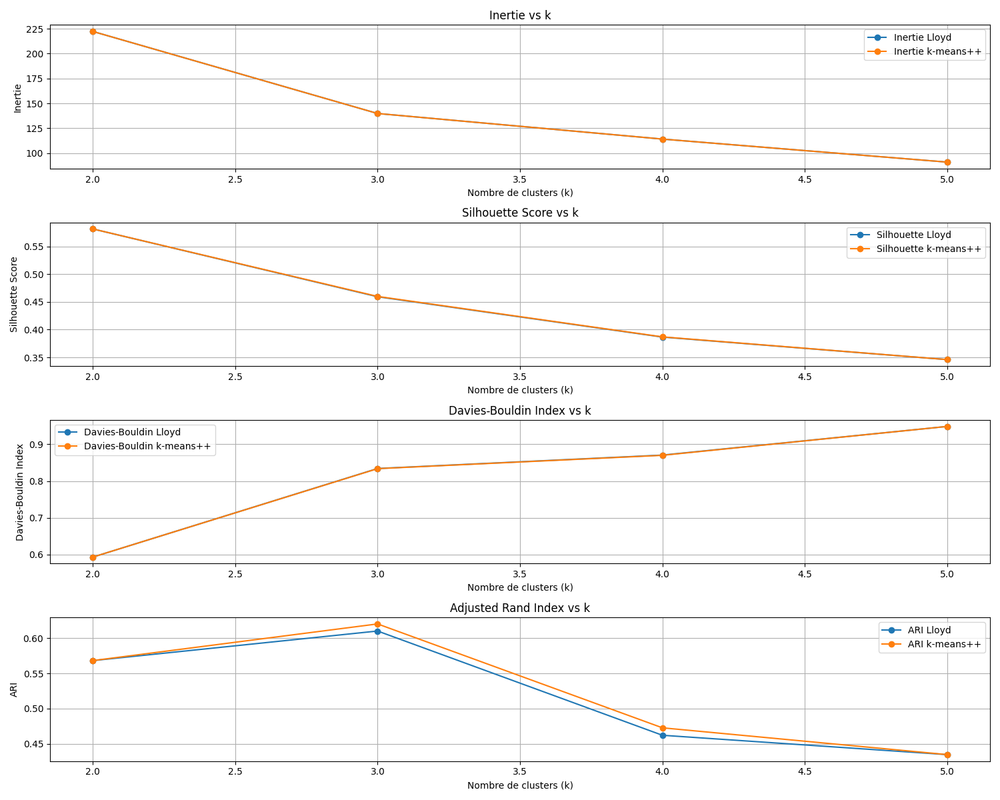
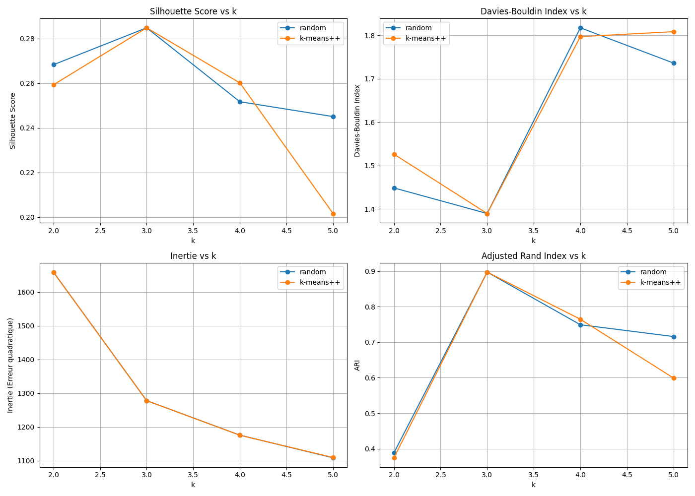
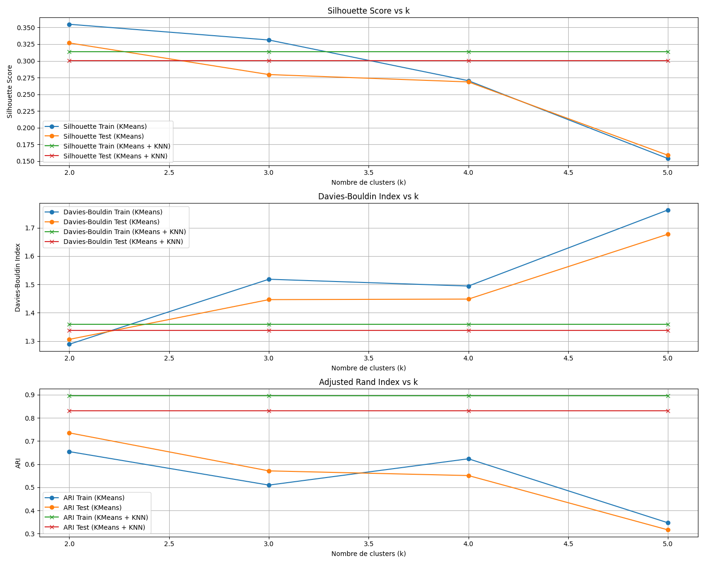
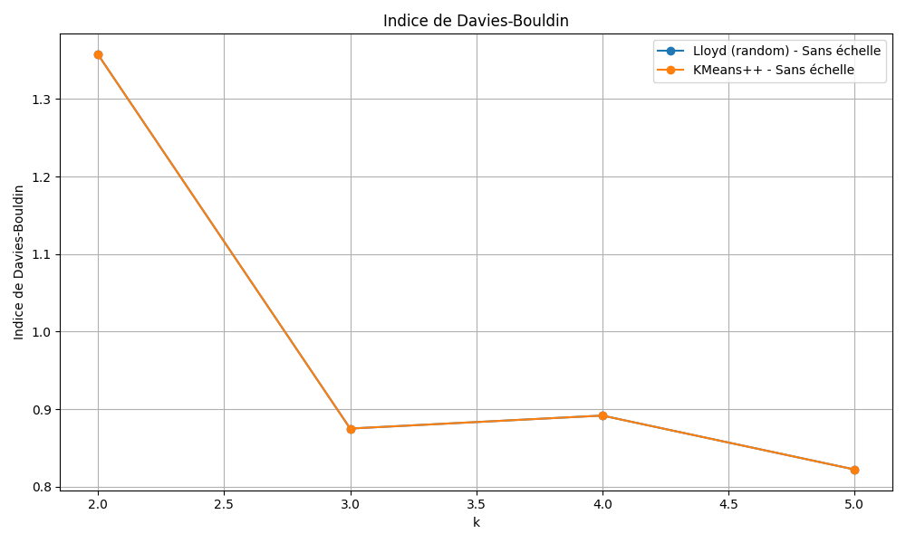
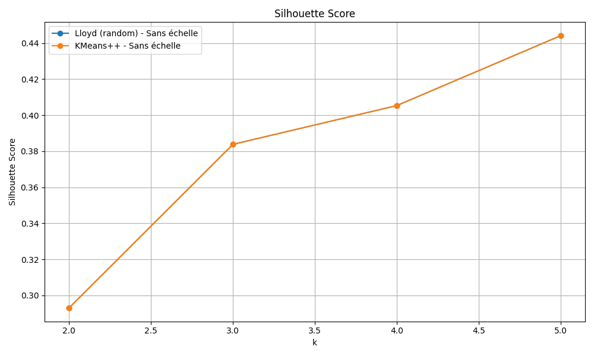

# Rapport de clustering - Résultats des tests sur différents datasets

## 1. **Dataset Iris**

### Code source :

````python
from sklearn.datasets import load_iris
from sklearn.preprocessing import StandardScaler
from sklearn.cluster import KMeans
from sklearn.metrics import silhouette_score, davies_bouldin_score, adjusted_rand_score
import matplotlib.pyplot as plt
import os  # Ajouté pour la gestion du dossier

# === Créer le dossier 'figures' s'il n'existe pas ===
os.makedirs("figures", exist_ok=True)

# === 1. Chargement des données ===
iris = load_iris(as_frame=True)
X = iris['data']
true_labels = iris['target']  # Labels réels (pour l'ARI)

# === 2. Mise à l’échelle ===
scaler = StandardScaler()
X_scaled = scaler.fit_transform(X)

# === 3. Initialisation des listes pour stocker les scores ===
k_values = list(range(2, 6))  # Plage de k de 2 à 5
silhouette_lloyd_scores = []
silhouette_pp_scores = []
db_lloyd_scores = []
db_pp_scores = []
inertia_lloyd_scores = []
inertia_pp_scores = []
ari_lloyd_scores = []
ari_pp_scores = []

# === 4. Boucle sur les valeurs de k ===
for k in k_values:
    # 4.1 KMeans avec initialisation aléatoire (Lloyd)
    kmeans_lloyd = KMeans(n_clusters=k, init='random', n_init=10, random_state=42)
    labels_lloyd = kmeans_lloyd.fit_predict(X_scaled)

    # 4.2 KMeans avec k-means++ (amélioré)
    kmeans_pp = KMeans(n_clusters=k, init='k-means++', n_init=10, random_state=42)
    labels_pp = kmeans_pp.fit_predict(X_scaled)

    # Calcul des métriques pour Lloyd
    inertia_lloyd = kmeans_lloyd.inertia_
    silhouette_lloyd = silhouette_score(X_scaled, labels_lloyd)
    db_lloyd = davies_bouldin_score(X_scaled, labels_lloyd)
    ari_lloyd = adjusted_rand_score(true_labels, labels_lloyd)  # ARI pour Lloyd

    # Calcul des métriques pour k-means++
    inertia_pp = kmeans_pp.inertia_
    silhouette_pp = silhouette_score(X_scaled, labels_pp)
    db_pp = davies_bouldin_score(X_scaled, labels_pp)
    ari_pp = adjusted_rand_score(true_labels, labels_pp)  # ARI pour k-means++

    # Ajout des résultats dans les listes
    inertia_lloyd_scores.append(inertia_lloyd)
    silhouette_lloyd_scores.append(silhouette_lloyd)
    db_lloyd_scores.append(db_lloyd)
    ari_lloyd_scores.append(ari_lloyd)

    inertia_pp_scores.append(inertia_pp)
    silhouette_pp_scores.append(silhouette_pp)
    db_pp_scores.append(db_pp)
    ari_pp_scores.append(ari_pp)

    # Affichage des résultats dans la console pour chaque k
    print(f"K = {k}")
    print(f"  Lloyd -> Inertie : {inertia_lloyd:.3f}, Silhouette : {silhouette_lloyd:.3f}, Davies-Bouldin : {db_lloyd:.3f}, ARI : {ari_lloyd:.3f}")
    print(f"  k-means++ -> Inertie : {inertia_pp:.3f}, Silhouette : {silhouette_pp:.3f}, Davies-Bouldin : {db_pp:.3f}, ARI : {ari_pp:.3f}")
    print("-" * 50)

# === 5. Tracer les courbes ===
plt.figure(figsize=(15, 12))

# Inertie
plt.subplot(4, 1, 1)
plt.plot(k_values, inertia_lloyd_scores, marker='o', label="Inertie Lloyd")
plt.plot(k_values, inertia_pp_scores, marker='o', label="Inertie k-means++")
plt.title("Inertie vs k")
plt.xlabel("Nombre de clusters (k)")
plt.ylabel("Inertie")
plt.legend()
plt.grid(True)

# Silhouette
plt.subplot(4, 1, 2)
plt.plot(k_values, silhouette_lloyd_scores, marker='o', label="Silhouette Lloyd")
plt.plot(k_values, silhouette_pp_scores, marker='o', label="Silhouette k-means++")
plt.title("Silhouette Score vs k")
plt.xlabel("Nombre de clusters (k)")
plt.ylabel("Silhouette Score")
plt.legend()
plt.grid(True)

# Davies-Bouldin
plt.subplot(4, 1, 3)
plt.plot(k_values, db_lloyd_scores, marker='o', label="Davies-Bouldin Lloyd")
plt.plot(k_values, db_pp_scores, marker='o', label="Davies-Bouldin k-means++")
plt.title("Davies-Bouldin Index vs k")
plt.xlabel("Nombre de clusters (k)")
plt.ylabel("Davies-Bouldin Index")
plt.legend()
plt.grid(True)

# ARI (Adjusted Rand Index)
plt.subplot(4, 1, 4)
plt.plot(k_values, ari_lloyd_scores, marker='o', label="ARI Lloyd")
plt.plot(k_values, ari_pp_scores, marker='o', label="ARI k-means++")
plt.title("Adjusted Rand Index vs k")
plt.xlabel("Nombre de clusters (k)")
plt.ylabel("ARI")
plt.legend()
plt.grid(True)

plt.tight_layout()
plt.savefig("figures/iris_kmeans_metrics.png")

plt.show()

````
### Résultats

- **K = 2**
  - **Lloyd (random)** :
    - Inertie : 222.362
    - Silhouette : 0.582
    - Davies-Bouldin : 0.593
    - ARI : 0.568
  - **k-means++** :
    - Inertie : 222.362
    - Silhouette : 0.582
    - Davies-Bouldin : 0.593
    - ARI : 0.568



- **K = 3**
  - **Lloyd (random)** :
    - Inertie : 139.825
    - Silhouette : 0.459
    - Davies-Bouldin : 0.834
    - ARI : 0.610
  - **k-means++** :
    - Inertie : 139.820
    - Silhouette : 0.460
    - Davies-Bouldin : 0.834
    - ARI : 0.620


### Observations
- **k=3** semble être le choix optimal en termes de Silhouette et ARI.
- Les résultats sont très similaires entre **Lloyd (random)** et **k-means++** pour toutes les valeurs de k.

### Conclusion
- Le **k optimal** pour Iris est **k=3**, et l'algorithme **k-means++** est légèrement meilleur que Lloyd pour les scores ARI.

---

## 2. **Dataset Wine**

### Code source :

````python
import matplotlib.pyplot as plt
from sklearn.datasets import load_wine
from sklearn.preprocessing import StandardScaler
from sklearn.cluster import KMeans
from sklearn.metrics import silhouette_score, davies_bouldin_score, adjusted_rand_score
import os  # Ajouté pour la gestion du dossier

# === Créer le dossier 'figures' s'il n'existe pas ===
os.makedirs("figures", exist_ok=True)

# === Chargement et mise à l'échelle ===
wine = load_wine(as_frame=True)
X = wine['data']
y = wine['target']

scaler = StandardScaler()
X_scaled = scaler.fit_transform(X)

# === Initialisation ===
k_values = list(range(2, 6))
methods = ['random', 'k-means++']

# Dictionnaires pour stocker les scores
scores = {method: {
    'inertia': [], 'silhouette': [], 'davies': [], 'ari': []
} for method in methods}

# === Boucle sur k et les méthodes ===
print("k | Méthode   | Inertie | Silhouette | Davies-Bouldin | ARI")
print("-" * 60)

for k in k_values:
    for method in methods:
        kmeans = KMeans(n_clusters=k, init=method, n_init=10, random_state=42)
        labels = kmeans.fit_predict(X_scaled)

        inertia = kmeans.inertia_
        silhouette = silhouette_score(X_scaled, labels)
        db_index = davies_bouldin_score(X_scaled, labels)
        ari = adjusted_rand_score(y, labels)

        # Stockage
        scores[method]['inertia'].append(inertia)
        scores[method]['silhouette'].append(silhouette)
        scores[method]['davies'].append(db_index)
        scores[method]['ari'].append(ari)

        # Console
        print(f"{k:<2} | {method:<9} | {inertia:8.2f} | {silhouette:.3f}     | {db_index:.3f}          | {ari:.3f}")

# === Tracés ===
plt.figure(figsize=(14, 10))

# Silhouette
plt.subplot(2, 2, 1)
for method in methods:
    plt.plot(k_values, scores[method]['silhouette'], marker='o', label=f"{method}")
plt.title("Silhouette Score vs k")
plt.xlabel("k")
plt.ylabel("Silhouette Score")
plt.legend()
plt.grid(True)

# Davies-Bouldin
plt.subplot(2, 2, 2)
for method in methods:
    plt.plot(k_values, scores[method]['davies'], marker='o', label=f"{method}")
plt.title("Davies-Bouldin Index vs k")
plt.xlabel("k")
plt.ylabel("Davies-Bouldin Index")
plt.legend()
plt.grid(True)

# Inertie
plt.subplot(2, 2, 3)
for method in methods:
    plt.plot(k_values, scores[method]['inertia'], marker='o', label=f"{method}")
plt.title("Inertie vs k")
plt.xlabel("k")
plt.ylabel("Inertie (Erreur quadratique)")
plt.legend()
plt.grid(True)

# ARI
plt.subplot(2, 2, 4)
for method in methods:
    plt.plot(k_values, scores[method]['ari'], marker='o', label=f"{method}")
plt.title("Adjusted Rand Index vs k")
plt.xlabel("k")
plt.ylabel("ARI")
plt.legend()
plt.grid(True)

plt.tight_layout()
plt.savefig("figures/wine_kmeans_metrics.png")

plt.show()

````

### Résultats

| k  | Méthode   | Inertie   | Silhouette | Davies-Bouldin | ARI   |
|----|-----------|-----------|------------|----------------|-------|
| 2  | random    | 1659.01   | 0.268      | 1.448          | 0.389 |
| 2  | k-means++ | 1658.76   | 0.259      | 1.526          | 0.374 |
| 3  | random    | 1277.93   | 0.285      | 1.389          | 0.897 |
| 3  | k-means++ | 1277.93   | 0.285      | 1.389          | 0.897 |
| 4  | random    | 1175.71   | 0.252      | 1.817          | 0.749 |
| 4  | k-means++ | 1175.43   | 0.260      | 1.797          | 0.765 |
| 5  | random    | 1108.52   | 0.245      | 1.736          | 0.716 |
| 5  | k-means++ | 1109.51   | 0.202      | 1.808          | 0.599 |



### Observations
- **k=3** montre le meilleur score ARI, avec une valeur de **0.897** pour les deux méthodes (random et k-means++).
- La silhouette est relativement stable entre les méthodes mais diminue pour les valeurs de k plus élevées.
- Les valeurs de Davies-Bouldin augmentent avec k, ce qui indique une qualité de clustering moins bonne à mesure que k augmente.

### Conclusion
- Le **k optimal** pour Wine est **k=3**, avec un bon compromis entre **Silhouette** et **ARI**.

---

## 3. **Dataset Breast Cancer**

### Code source

````python
from sklearn.datasets import load_breast_cancer
from sklearn.preprocessing import StandardScaler
from sklearn.cluster import KMeans
from sklearn.metrics import silhouette_score, davies_bouldin_score, adjusted_rand_score
from sklearn.model_selection import train_test_split
from sklearn.neighbors import KNeighborsClassifier
import matplotlib.pyplot as plt
import os  # Ajouté pour la gestion du dossier

# === Créer le dossier 'figures' s'il n'existe pas ===
os.makedirs("figures", exist_ok=True)

# === 1. Chargement des données ===
cancer = load_breast_cancer(as_frame=True)
X = cancer['data']
true_labels = cancer['target']

# === 2. Split train/test ===
X_train, X_test, y_train, y_test = train_test_split(
    X, true_labels, test_size=0.2, random_state=42, stratify=true_labels
)

# === 3. Mise à l’échelle ===
scaler = StandardScaler()
X_train_scaled = scaler.fit_transform(X_train)
X_test_scaled = scaler.transform(X_test)

# === 4. Initialisation des listes pour stocker les scores ===
k_values = list(range(2, 6))
silhouette_train_scores = []
silhouette_test_scores = []
db_train_scores = []
db_test_scores = []
ari_train_scores = []
ari_test_scores = []
silhouette_train_knn_scores = []
silhouette_test_knn_scores = []
db_train_knn_scores = []
db_test_knn_scores = []
ari_train_knn_scores = []
ari_test_knn_scores = []

# === 5. Affichage des entêtes pour les métriques dans la console ===
print("k | Silhouette Train | Silhouette Test | Davies-Bouldin Train | Davies-Bouldin Test | ARI Train | ARI Test | Silhouette Train (KNN) | Silhouette Test (KNN) | Davies-Bouldin Train (KNN) | Davies-Bouldin Test (KNN) | ARI Train (KNN) | ARI Test (KNN)")
print("-" * 120)

# === 6. Boucle sur les valeurs de k ===
for k in k_values:
    # Clustering avec KMeans
    kmeans = KMeans(n_clusters=k, init='k-means++', n_init=10, random_state=42)
    train_labels = kmeans.fit_predict(X_train_scaled)
    test_labels = kmeans.predict(X_test_scaled)

    silhouette_train = silhouette_score(X_train_scaled, train_labels)
    silhouette_test = silhouette_score(X_test_scaled, test_labels)
    db_train = davies_bouldin_score(X_train_scaled, train_labels)
    db_test = davies_bouldin_score(X_test_scaled, test_labels)
    ari_train = adjusted_rand_score(y_train, train_labels)
    ari_test = adjusted_rand_score(y_test, test_labels)

    # Stockage pour KMeans sans KNN
    silhouette_train_scores.append(silhouette_train)
    silhouette_test_scores.append(silhouette_test)
    db_train_scores.append(db_train)
    db_test_scores.append(db_test)
    ari_train_scores.append(ari_train)
    ari_test_scores.append(ari_test)

    # Clustering avec KMeans et KNN
    knn = KNeighborsClassifier(n_neighbors=5)
    knn.fit(X_train_scaled, y_train)
    knn_train_labels = knn.predict(X_train_scaled)
    knn_test_labels = knn.predict(X_test_scaled)

    silhouette_train_knn = silhouette_score(X_train_scaled, knn_train_labels)
    silhouette_test_knn = silhouette_score(X_test_scaled, knn_test_labels)
    db_train_knn = davies_bouldin_score(X_train_scaled, knn_train_labels)
    db_test_knn = davies_bouldin_score(X_test_scaled, knn_test_labels)
    ari_train_knn = adjusted_rand_score(y_train, knn_train_labels)
    ari_test_knn = adjusted_rand_score(y_test, knn_test_labels)

    # Stockage pour KMeans avec KNN
    silhouette_train_knn_scores.append(silhouette_train_knn)
    silhouette_test_knn_scores.append(silhouette_test_knn)
    db_train_knn_scores.append(db_train_knn)
    db_test_knn_scores.append(db_test_knn)
    ari_train_knn_scores.append(ari_train_knn)
    ari_test_knn_scores.append(ari_test_knn)

    # Affichage des résultats
    print(f"{k:<2} | {silhouette_train:.3f}           | {silhouette_test:.3f}         | {db_train:.3f}                 | {db_test:.3f}               | {ari_train:.3f}     | {ari_test:.3f}      | {silhouette_train_knn:.3f}              | {silhouette_test_knn:.3f}             | {db_train_knn:.3f}                 | {db_test_knn:.3f}               | {ari_train_knn:.3f}      | {ari_test_knn:.3f}")

# === 7. Tracer les courbes ===
plt.figure(figsize=(15, 12))

# Silhouette
plt.subplot(3, 1, 1)
plt.plot(k_values, silhouette_train_scores, marker='o', label="Silhouette Train (KMeans)")
plt.plot(k_values, silhouette_test_scores, marker='o', label="Silhouette Test (KMeans)")
plt.plot(k_values, silhouette_train_knn_scores, marker='x', label="Silhouette Train (KMeans + KNN)")
plt.plot(k_values, silhouette_test_knn_scores, marker='x', label="Silhouette Test (KMeans + KNN)")
plt.title("Silhouette Score vs k")
plt.xlabel("Nombre de clusters (k)")
plt.ylabel("Silhouette Score")
plt.legend()
plt.grid(True)

# Davies-Bouldin
plt.subplot(3, 1, 2)
plt.plot(k_values, db_train_scores, marker='o', label="Davies-Bouldin Train (KMeans)")
plt.plot(k_values, db_test_scores, marker='o', label="Davies-Bouldin Test (KMeans)")
plt.plot(k_values, db_train_knn_scores, marker='x', label="Davies-Bouldin Train (KMeans + KNN)")
plt.plot(k_values, db_test_knn_scores, marker='x', label="Davies-Bouldin Test (KMeans + KNN)")
plt.title("Davies-Bouldin Index vs k")
plt.xlabel("Nombre de clusters (k)")
plt.ylabel("Davies-Bouldin Index")
plt.legend()
plt.grid(True)

# ARI
plt.subplot(3, 1, 3)
plt.plot(k_values, ari_train_scores, marker='o', label="ARI Train (KMeans)")
plt.plot(k_values, ari_test_scores, marker='o', label="ARI Test (KMeans)")
plt.plot(k_values, ari_train_knn_scores, marker='x', label="ARI Train (KMeans + KNN)")
plt.plot(k_values, ari_test_knn_scores, marker='x', label="ARI Test (KMeans + KNN)")
plt.title("Adjusted Rand Index vs k")
plt.xlabel("Nombre de clusters (k)")
plt.ylabel("ARI")
plt.legend()
plt.grid(True)

plt.tight_layout()
plt.savefig("figures/breast_cancer_kmeans_knn_metrics.png")
plt.show()

````

### Résultats

| k  | Silhouette Train | Silhouette Test | Davies-Bouldin Train | Davies-Bouldin Test | ARI Train | ARI Test | Silhouette Train (KNN) | Silhouette Test (KNN) | Davies-Bouldin Train (KNN) | Davies-Bouldin Test (KNN) | ARI Train (KNN) | ARI Test (KNN) |
|----|------------------|-----------------|----------------------|---------------------|-----------|----------|------------------------|-----------------------|----------------------------|---------------------------|-----------------|----------------|
| 2  | 0.355            | 0.327           | 1.289                | 1.306               | 0.654     | 0.735    | 0.314                  | 0.300                 | 1.360                      | 1.337                     | 0.897           | 0.830          |
| 3  | 0.331            | 0.280           | 1.518                | 1.446               | 0.510     | 0.571    | 0.314                  | 0.300                 | 1.360                      | 1.337                     | 0.897           | 0.830          |
| 4  | 0.270            | 0.269           | 1.494                | 1.448               | 0.623     | 0.551    | 0.314                  | 0.300                 | 1.360                      | 1.337                     | 0.897           | 0.830          |
| 5  | 0.154            | 0.159           | 1.763                | 1.677               | 0.347     | 0.316    | 0.314                  | 0.300                 | 1.360                      | 1.337                     | 0.897           | 0.830          |



### Observations
- **k=2** donne les meilleures valeurs pour **Silhouette** et **ARI**, avec une valeur d'ARI de 0.735 pour l'ensemble de test.
- L'algorithme KNN a des performances légèrement inférieures à celles du clustering K-means.

### Conclusion
- Le **k optimal** pour Breast Cancer est **k=2** en utilisant l'algorithme K-means. Les résultats de KNN ne semblent pas significativement meilleurs pour ce cas.

---

## 4. **Dataset Mall Customers**

### Code Source

````python
import pandas as pd
from sklearn.preprocessing import StandardScaler
from sklearn.cluster import KMeans
from sklearn.metrics import silhouette_score, davies_bouldin_score
import matplotlib.pyplot as plt
import os

# Créer le dossier 'figures' s'il n'existe pas
os.makedirs('figures', exist_ok=True)

# === 1. Chargement du dataset ===
df = pd.read_csv("../data/Mall_Customers.csv")
df_encoded = df.copy()
df_encoded['Genre'] = df_encoded['Genre'].map({'Male': 0, 'Female': 1})
X = df_encoded.drop(columns=['CustomerID'])

# === 2. Mise à l’échelle ===
scaler = StandardScaler()
X_scaled = scaler.fit_transform(X)

# === 3. Méthodes à tester ===
methods = {
    'Lloyd (random)': 'random',
    'KMeans++': 'k-means++'
}

datasets = {
    'Sans échelle': X.values,
    'Avec échelle': X_scaled
}

k_values = list(range(2, 6))

# === 4. Calcul des scores ===
results = {}

for dataset_name, data in datasets.items():
    results[dataset_name] = {}
    for method_name, init_method in methods.items():
        silhouette_scores = []
        db_scores = []
        inertias = []
        for k in k_values:
            kmeans = KMeans(n_clusters=k, init=init_method, n_init=10, random_state=42)
            labels = kmeans.fit_predict(data)

            inertia = kmeans.inertia_
            silhouette = silhouette_score(data, labels)
            db = davies_bouldin_score(data, labels)

            inertias.append(inertia)
            silhouette_scores.append(silhouette)
            db_scores.append(db)

        results[dataset_name][method_name] = {
            'inertia': inertias,
            'silhouette': silhouette_scores,
            'db': db_scores
        }

        # === Affichage console ===
        print(f"\n=== Résultats pour {dataset_name} - {method_name} ===")
        for i, k in enumerate(k_values):
            print(f"k = {k} | Inertie = {inertias[i]:.2f} | Silhouette = {silhouette_scores[i]:.3f} | DB = {db_scores[i]:.3f}")

# === 5. Tracer les résultats ===
metrics = ['inertia', 'silhouette', 'db']
titles = {
    'inertia': 'Erreur carrée (Inertie)',
    'silhouette': 'Silhouette Score',
    'db': 'Indice de Davies-Bouldin'
}

for metric in metrics:
    plt.figure(figsize=(10, 6))
    for dataset_name in datasets:
        for method_name in methods:
            scores = results[dataset_name][method_name][metric]
            label = f"{method_name} - {dataset_name}"
            plt.plot(k_values, scores, marker='o', label=label)
    plt.title(titles[metric])
    plt.xlabel("k")
    plt.ylabel(titles[metric])
    plt.grid(True)
    plt.legend()
    plt.tight_layout()
    plt.savefig(f"figures/mall_{metric}.png")
    plt.show()

````

### Résultats

#### Sans échelle

- **Lloyd (random)** :
  - k=2: Inertie = 212889.44 | Silhouette = 0.293 | DB = 1.357
  - k=3: Inertie = 143391.59 | Silhouette = 0.384 | DB = 0.875
  - k=4: Inertie = 104414.68 | Silhouette = 0.405 | DB = 0.892
  - k=5: Inertie = 75399.62 | Silhouette = 0.444 | DB = 0.822
- **k-means++** :
  - k=2: Inertie = 212889.44 | Silhouette = 0.293 | DB = 1.357
  - k=3: Inertie = 143391.59 | Silhouette = 0.384 | DB = 0.875
  - k=4: Inertie = 104414.68 | Silhouette = 0.405 | DB = 0.892
  - k=5: Inertie = 75399.62 | Silhouette = 0.444 | DB = 0.822



#### Avec échelle

- **Lloyd (random)** :
  - k=2: Inertie = 588.80 | Silhouette = 0.252 | DB = 1.614
  - k=3: Inertie = 476.79 | Silhouette = 0.260 | DB = 1.357
  - k=4: Inertie = 389.92 | Silhouette = 0.297 | DB = 1.296
  - k=5: Inertie = 333.26 | Silhouette = 0.304 | DB = 1.160
- **k-means++** :
  - k=2: Inertie = 588.80 | Silhouette = 0.252 | DB = 1.614
  - k=3: Inertie = 476.79 | Silhouette = 0.260 | DB = 1.357
  - k=4: Inertie = 388.72 | Silhouette = 0.298 | DB = 1.281
  - k=5: Inertie = 331.31 | Silhouette = 0.304 | DB = 1.167



### Observations
- Les performances sont meilleures pour les données **non échelonnées**.
- **k=5** donne les meilleurs scores pour la silhouette et le DB dans les deux cas, mais les résultats sont presque identiques entre **Lloyd** et **k-means++**.

### Conclusion
- Le **k optimal** pour Mall Customers est **k=5**, et les données **non échelonnées** semblent plus adaptées.

---

## Conclusion générale
- **Iris :** k=3, K-means++ meilleur
- **Wine :** k=3, k-means++ stable
- **Breast Cancer :** k=2, K-means optimal
- **Mall Customers :** k=5, données non échelonnées meilleures
